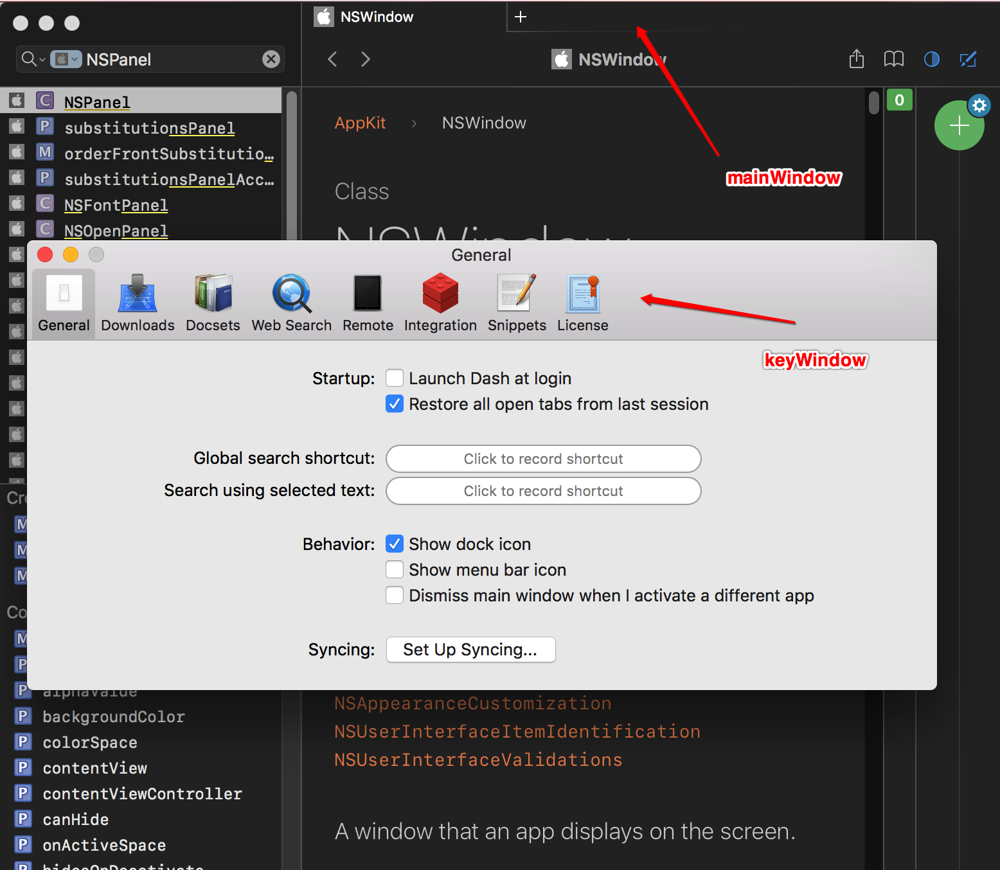
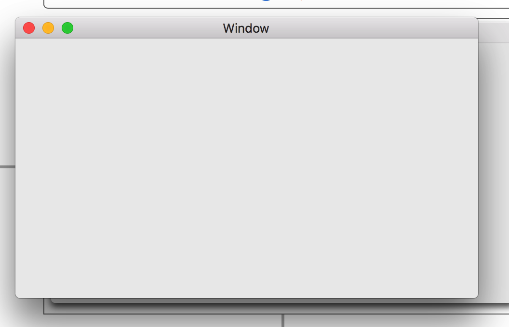
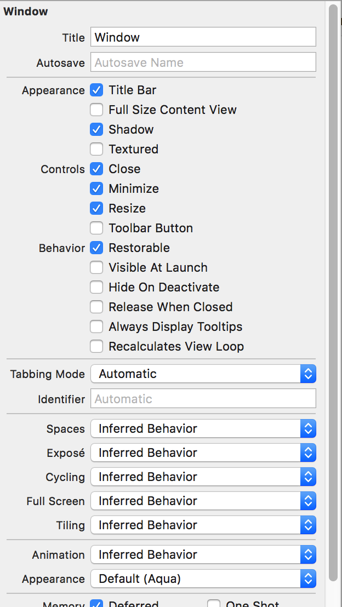

# Mac 开发之 `NSWindow`  

### 完成状态

- [ ] 开发中 
- [ ] 维护中
- [x] 未完成

### `NSWindow` 简介  
> A window that an app displays on the screen.   
> 在屏幕显示的一个窗口  

以上是 Apple 文章中针对 `NSWindow` 的介绍，非常之简介，就是一个显示在屏幕上的一个窗口。`NSWindow` 的功能就是放置需要的UI控件并处理用户的事件和键盘事件。`NSWindow` 是Mac开发中的一个很重要的概念，除了部分特殊的 UI 控件，大部分控件都必须依附在一个 `NSWindow` 上才可以显示。在UI 界面显示中，`NSWindow` 是所有界面的根节点。所有界面都必须包含在一个`NSWindow` 下才可以在屏幕上看到。  

一般情况下，每一个应用程序启动后至少会打开一个窗口(`NSWindow`),当然除了特殊的应用程序，比如单纯的顶部状态栏程序，可以不需要`NSWindow`,这个会在后续具体介绍。由于Mac的特殊性,Mac支持多任务多程序同时处理能力，可以同时打开多个程序。不过虽然可以在屏幕上同时显示多个程序，但是在相同时间内只会有一个窗口处理激活状态，其他都将处于未激活状态  
  
上图的说明可能不够明显，需要自己去体会，两种状态在顶部会有一点点的颜色差别     

#### keyWindow 与 mainWindow 的异同  
虽然在同一时刻只能有一个窗口处于活动状态，也就是`mainWindow`.不过有时候回出现特说情况就是由于一些操作，比如设置等等会在当前活动窗口之弹出新的窗口界面，此时，弹出的子窗口是依附于父窗口存在的。此时可以接收用户事件的就不是`mainWindow` 而是弹出的这个子窗口，此时子窗口就被称为 `keyWindow`.在相同时刻，只能存在一个 `keyWindow` 和 `mainWindow`。 以上可能说的有点绕，只要记住以下几句话就好 ：

* `mainWindow`: 当前活动的窗口。简洁划分就是以程序来划分   
* `keyWindow` : 当前可以接收输入事件(鼠标，键盘，触摸板等操作)的窗口。一般此窗口可以是 mainWindow 或者建立在其之上的 子窗口    
* 相同时刻只会存在一个 keyWindow 和 mainWindow, mainWindow和keyWindow 可以同时是一个窗口    

虽然mianWindow 可以是keyWindow， 但并不是所有的Window都可以作为mainWindow, 有些基于 NSWindow 的控件只能作为 keyWindow 来依附于 mainWindow,为其服务，并不能单独成为 mainWindow。比如`NSPanel` 的部分子类：NSColorPanel(颜色选择),NSFontPanel(字体选择),NSSavePanel(保存文件),这些子类只能作为keyWindow 不能称为 mainWindow   

以上介绍了很多关于窗口的内容，那么到底什么是窗口，窗口是什么样的呢？ 下面将具体介绍窗口的显示，如何创建窗口以及如何显示窗口    

#### 窗口显示   
默认情况下，新建的 Mac 项目中就会自带一个窗口，可以在`Main.storyboard` 文件中查看。默认情况下，窗口显示时此种样式  
  
  
默认窗口就是如上显示形式，可以通过storyboard 进行界面化的修改设置，默认情况下，窗口带有一个控制器(ContentViewController),窗口通过管理此控制器来管理其中的控件，所有的控件操作都将在此控制器中实现。具体的显示将在ContentView 部分显示

