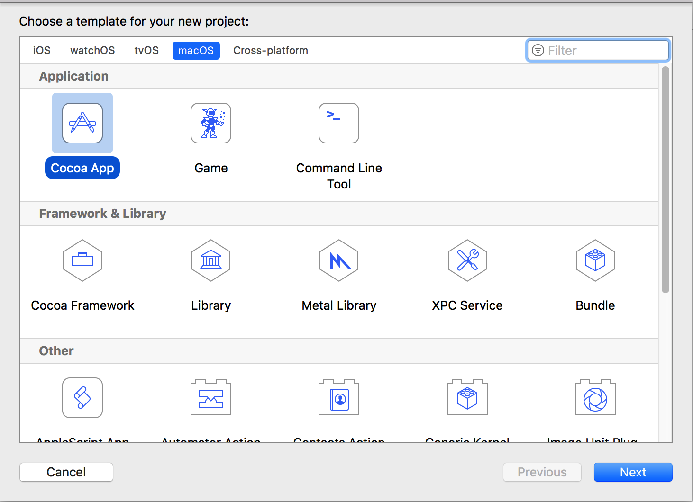
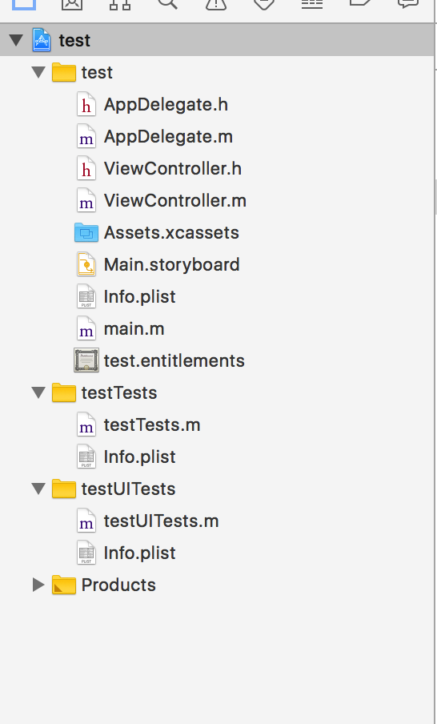

# Mac开发之 `NSApplication`   

### 完成状态

- [ ] 开发中 
- [ ] 维护中
- [x] 未完成

### `NSApplication` 简介  
> An object that manages an app’s main event loop and resources used by all of that app’s objects  
> 管理应用程序的主事件循环和和应用程序中的所有资源对象   


以上是 Apple 针对 `NSApplication` 的简介。很简洁，从以上可以看出`NSApplication` 主要负责两个功能：1, 负责程序的事件循环； 2, 负责管理程序中的各种对象。 在Mac中， 每一个 `NSApplication` 都可以看成是一个单独的程序，可以通过 `NSApplication` 来划分程序的概念。每一个程序都使用一个`NSApplication` 单利来管理主事件循环和所有程序中的资源以及窗口显示。在开发中， 所有的操作都是在 `NSApplication` 内的。再多的介绍都不如创建个模板工程来的直观。接下来，通过创建一个空工程来详细介绍    

### 创建实例工程  
1. 创建工程  
    通过欢迎界面的 `Create a new Xcode project` 或者 `file`--> `Create a new Xcode project`来创建  
       
2. 选择工程类型  
    Xcode 在Mac下可以创建3种工程，`Cocoa App`, `Game`, `Command Line Tool`, 分别是应用程序， 游戏， 命令行工程， 在这里我们学习的是如何应用程序开发， 所有选择的是第一种 。  
    
3. 填写需要的信息  
    根据需要填写需要的信息， 然后直接下一步进行保存就好
4. 目录结构  
    默认创建的工程是一下结构  
    


### 代码分析  
本节主要介绍的是 `NSApplication` 但是，当你在项目中找`NSApplication` 的时候，你会发现并没有此对象存在，难道上边的介绍错误了？？    
如果你查看过开发文档会发现，在`NSApplication` 的详细描述中可以看到如下介绍  

> After creating the application object, the main() function should load your app’s main nib file and then start the event loop by sending the application object a run message. If you create an Application project in Xcode, this main() function is created for you. The main() function Xcode creates begins by calling a function named NSApplicationMain(), which is functionally similar to the following:   

```objectivec  
void NSApplicationMain(int argc, char *argv[]) {
    [NSApplication sharedApplication];
    [NSBundle loadNibNamed:@"myMain" owner:NSApp];
    [NSApp run];
}
```  
现在明白了吧， 其实并不是没有，只是通过 main 函数中调用的`NSApplicationMain` 给代替了，这个函数内部创建了`NSApplication` 对象并添加了实现。所以在项目中 main 函数看起来才如此简洁   

```objectivec
int main(int argc, const char * argv[]) {
    return NSApplicationMain(argc, argv);
}
```

通过以上方式了解了系统时如何创建`NSApplication` 对象的，那么系统时如何通过`NSApplication` 管理事件的呢？   

每一个 `NSApplication` 都有一个代理对象，在此测试项目中对应`AppDelegate.m` 文件中，`NSApplication`主要负责资源管理和UI 界面的管理以及事件管理，但是关于应用程序的启动，隐藏，退出或者用户选择文件等等操作是通过代理来实现的。针对此种类型的事件，并没有交给它自己来处理，而是交给代理然后让用户来决定如何处理(毕竟自杀的也只是少部分不是吗?😜)。默认情况下，`AppDelegate.m` 文件中只是实现了两个代理方法模板。  

```objectivec 
- (void)applicationDidFinishLaunching:(NSNotification *)aNotification {
    // Insert code here to initialize your application   
    // App  启动时调用
}

- (void)applicationWillTerminate:(NSNotification *)aNotification {
    // Insert code here to tear down your application
    //APP 终止时调用
}
```   

#### 后续说明

以上只是针对  `NSApplication` 的简单介绍，后续会根据进度和不同情况下针对方法的使用情况有针对性的对`NSApplication` 以及其代理中的方法进行更加具体的介绍。 请关注后续文章， 谢谢


